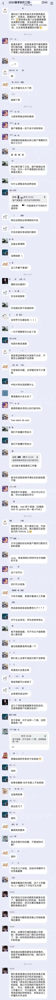
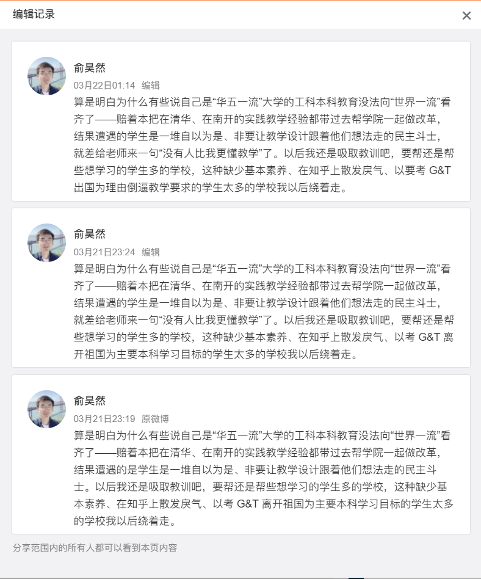
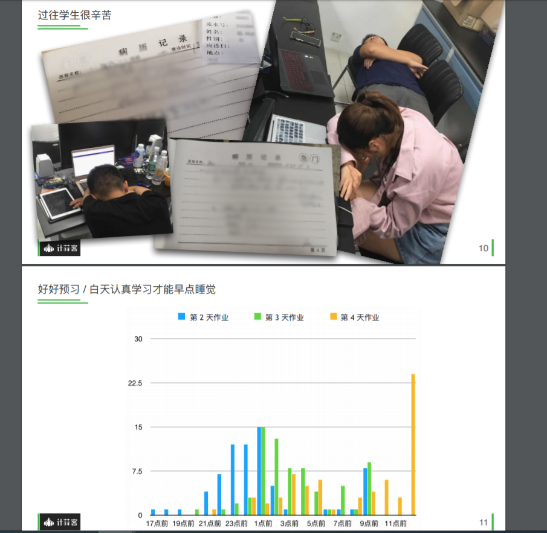

# 计蒜客软工外包事件记录

这个仓库用于记录中科大软件工程课程外包给计蒜客事件，欢迎利益相关的同学提 Pull Request（请将信息贡献到“时间线”或“其他”部分）。

<!-- TOC -->

- [计蒜客软工外包事件记录](#计蒜客软工外包事件记录)
    - [事件简介](#事件简介)
    - [时间线](#时间线)
        - [2020.3.19 晚 被告知是和商业公司合作](#2020319-晚-被告知是和商业公司合作)
        - [2020.3.21 晚 要求使用 GPL/AGPL 许可被拒绝](#2020321-晚-要求使用-gplagpl-许可被拒绝)
        - [2020.3.21 23:19 俞昊然微博地图炮、人身攻击](#2020321-2319-俞昊然微博地图炮人身攻击)
        - [......](#)
    - [其他](#其他)
        - [此课程在其他学校的开设情况](#此课程在其他学校的开设情况)
        - [......](#-1)
    - [如何贡献](#如何贡献)

<!-- /TOC -->

## 事件简介

> 请文笔尚好的同学概括性地介绍下这件事情。

## 时间线

> 请将相关重要事件按时间先后顺序在此列下，引用的图片放到 `./images/` 目录里，同时不要忘了更新最上面的 TOC。

### 2020.3.19 晚 被告知是和商业公司合作

### 2020.3.21 晚 要求使用 GPL/AGPL 许可被拒绝

> 此处需要聊天截图。

### 2020.3.21 23:19 俞昊然微博地图炮、人身攻击

2020.3.21 23:19 计蒜客平台 CEO 俞昊然在微博平台发表地图炮、人身攻击言论，详见 <https://www.weibo.com/haoranyu>。

### ......

## 其他

> 请将不适合放在“时间线”部分的东西在此列下，引用的图片放到 `./images/` 目录里，同时不要忘了更新最上面的 TOC。

### 此课程在其他学校的开设情况

> 据悉这个课程在清华大学和南开大学也开过，请相关知情同学更新此部分。

**病历努力论**

南开大学软件工程实训综述ppt中，将参与实训的学生的病历作为“教学成果”展示。

### ......

## 如何贡献

欢迎利益相关的同学提 Pull Request（请将信息贡献到“时间线”或“其他”部分）。关于如何提 PR，见 <https://help.github.com/en/github/collaborating-with-issues-and-pull-requests/creating-a-pull-request>。请勾选上“Allow edits from maintainers”，方便维护者对格式等进行修改。

相关注意事项：

- 图片中敏感信息（如群名片、群名）必须打码；
- 文明发言，用事实说话，无需夸大；
