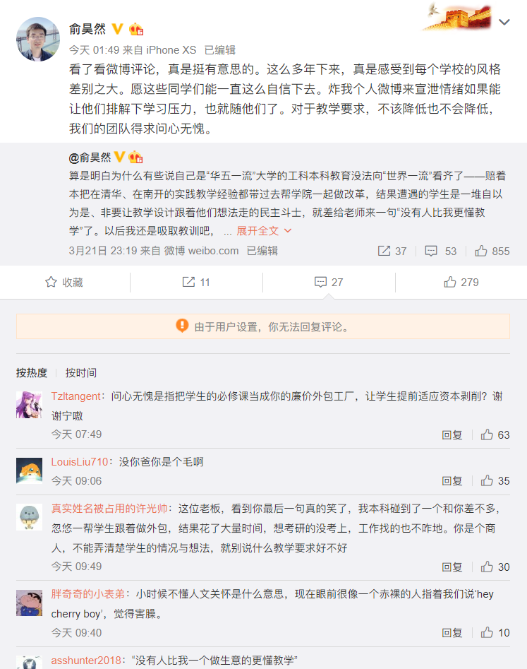
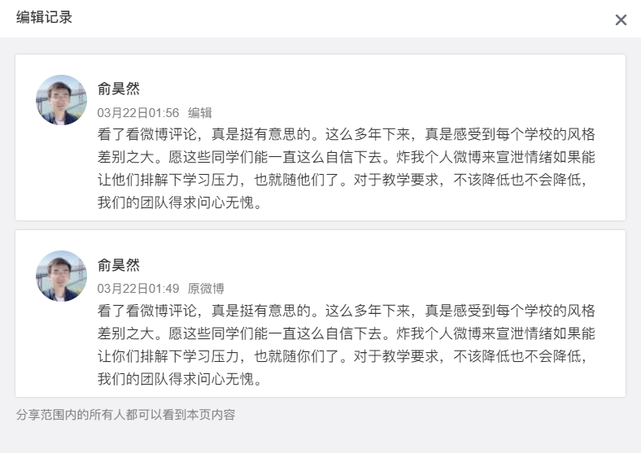

# 计蒜客软工外包事件记录

这个仓库用于记录中科大软件工程课程外包给计蒜客事件，欢迎利益相关的同学提 Pull Request（请将信息贡献到“时间线”或“其他”部分）。

<!-- TOC -->

- [计蒜客软工外包事件记录](#计蒜客软工外包事件记录)
    - [事件简介](#事件简介)
    - [时间线](#时间线)
        - [2020.3.19 晚 被告知是和商业公司合作](#2020319-晚-被告知是和商业公司合作)
        - [2020.3.21 晚 要求使用 GPL/AGPL 许可被拒绝](#2020321-晚-要求使用-gplagpl-许可被拒绝)
        - [2020.3.21 23:19 俞昊然微博地图炮、人身攻击](#2020321-2319-俞昊然微博地图炮人身攻击)
        - [......](#)
    - [其他](#其他)
        - [计蒜客软工课程和其他学校的合作情况](#计蒜客软工课程和其他学校的合作情况)
        - [......](#-1)
    - [如何贡献](#如何贡献)

<!-- /TOC -->

## 事件简介

2020 年春季学期是中科大《软件工程》课程改革的第一个学期，改革后的课程分为课堂教学和工程实践两部分，后者由计蒜客负责。同学们得知工程实践的组队大作业的目标客户是真实客户后，为了保护自己的权益，希望自己的代码能够使用 GPL 家族的开源许可，但是[计蒜客要求使用 BSD 许可](#2020321-晚-要求使用-gplagpl-许可被拒绝)；计蒜客 CEO [俞昊然在微博发表地图炮、人身攻击言论](#2020321-2319-俞昊然微博地图炮人身攻击)。

参考[知乎问题](https://www.zhihu.com/question/381341101)。

## 时间线

> 请将相关重要事件按时间先后顺序在此列下，引用的图片放到 `./images/` 目录里，同时不要忘了更新最上面的 TOC。

### 2020.3.19 晚 被告知是和商业公司合作

<details>
  <summary>点击查看聊天记录截图</summary>


</details>

### 2020.3.21 晚 要求使用 GPL/AGPL 许可被拒绝

计蒜客的要求：使用 BSD 开源许可。

同学们的想法：使用 GPL/AGPL 这类许可。

关于两类开源许可的差别，阮一峰的博客有张翻译的图。


如果使用 GPL/AGPL 这类授权，若是我们做的还行、客户想用于商业用途（虽然这个概率很小），那么客户可以与我们商量（比如给与我们一定回报），我们可以更换开源授权或者直接把软件闭源并卖给客户（我们会在开发期间保证处于 private 环境，使得没人其他人以 GPL/AGPL 获得过代码，所以这样是完全可行的，详见 [Stack Overfow](https://stackoverflow.com/a/5420080/8418049)）；而若是做的不好、客户不想用的话，那么代码就继续以 GPL/AGPL 许可开源即可。

而若是使用 BSD 开源授权，那么从一开始我们就失去了主动权：我们给客户提供了定制化服务之后，若是客户认为我们做的可以用，就可以直接将其闭源，用于商业用途。客户给不给我们回报、给多少回报都将是客户说的算。

因此为了保护我们的权益，我们要求使用 GPL/AGPL 这类授权，但是计蒜客方面一直坚持使用 BSD 授权。

> 暂未获得聊天截图，只有下面的文字记录，此处需要补充上聊天截图。

<details>
  <summary>点击查看文字聊天记录</summary>

```
学生1 3/21/2020 17:09:15
助教1
这个问题计蒜客那边在讨论啦，不用着急
想起来这个，请问有结果了么（license 的问题）
学生2 3/21/2020 17:10:19
license and free labor

助教1 3/21/2020 17:36:36
要GPL而不是BSD的理由是啥

学生2 3/21/2020 17:37:30
不打白工

学生2 3/21/2020 17:37:45
（GPL 意义有限，AGPL 比较合适）

学生2 3/21/2020 17:38:23
现在我们一直不清楚，是不是「我们干活，计蒜客收钱」的模式

助教1 3/21/2020 17:39:24
我们找客户 不是客户付我们钱 而是我们付客户钱 这些都是客户自己遇到的并且想要解决的最真实的需求 轻易是不会放出来而不是自己做的
然后客户本身对于知识产权也是有要求的

助教1 3/21/2020 17:40:29
from jisuanke

学生2 3/21/2020 17:40:33
那么，我们为什么不做开源项目呢？

助教1 3/21/2020 17:41:22
计蒜客老师说可以用 GPL 只要能给出比较make sense的理由

助教1 3/21/2020 17:42:02
特别介意的可以再自己向计蒜客老师和李老师咨询下

学生3 3/21/2020 17:42:15
那自选题目是不是就可以自选licence了

学生2 3/21/2020 17:42:25
我并不是很理解这个逻辑，“最真实的需求”反而“轻易不会放出来”

助教1 3/21/2020 17:42:37
自选题目应该完全自主

学生2 3/21/2020 17:42:44
我只在学术界 great idea 见过这种情况

学生3 3/21/2020 17:43:00
很奇怪，很奇怪.jpg

学生1 3/21/2020 17:43:06
助教1
要GPL而不是BSD的理由是啥
相对来说，选一个 copyleft 的 license 更能保护我们的权益，所以倾向于 GPL 家族。当然，就算我们最后选了一个 copyleft 的 license，商业公司也可以想着我们是学生没什么力量所以不遵守，但那就是另外一回事了

学生2 3/21/2020 17:43:31
现在说白了，我们还是不清楚我们的项目究竟是给谁做

学生2 3/21/2020 17:44:00
给自己做——为什么不能自己定 license 这些；给计蒜客做——free labor？

学生2 3/21/2020 17:44:21
这个问题一直都没有得到正面的回答

学生1 3/21/2020 17:44:27
如果用 BSD 或者 MIT 这类 permissive 的，就算我们可以得到计蒜客给的收益，但是显然我们是学生，在这个过程肯定会吃亏

学生1 3/21/2020 17:44:36
所以不如从一开始就拒绝这样

学生2 3/21/2020 17:44:55
上次李老师说的，“如果能被公司压迫”，我觉得现在就有点这个倾向

学生2 3/21/2020 17:45:18
压迫，直白的理解就是逼着你干活又不给你足够的待遇

学生1 3/21/2020 17:46:08
（完全可以先答应我们用 GPL 家族的协议，反正我们是学生现在力量也有限没法找他们事，可以等我们以后变强了再去维权）

学生2 3/21/2020 17:46:21
要 AGPL，因为都是 webapp

学生2 3/21/2020 17:46:39
GNU Affero General Public License

学生2 3/21/2020 17:47:31
不绝对地说，GPL 更适用于有“编译”成分的作品，这个“编译”的逆过程不那么直接或者有一定困难

学生3 3/21/2020 17:47:32
很奇怪，很奇怪.jpg

学生3 3/21/2020 17:48:06
我觉得我们可以自选题目，而题目和jisuanke的题目一致

学生3 3/21/2020 17:48:16
所以为什么这不能叫自选的呢

学生4 3/21/2020 17:48:41
请问一下我们这种自选题目该怎么做那个需求分析和思维脑图啊？

助教2 3/21/2020 17:49:10
我觉得，你们要不要问问清华的同学，他们上软工课为什么接受bsd协议

学生2 3/21/2020 17:49:39
我不反对计蒜客收钱，毕竟人家也提供了学习平台和学习资料（质量是另一个问题），但是如果有这种情况，能不能透明一点？

学生1 3/21/2020 17:50:28
助教2
我觉得，你们要不要问问清华的同学，他们上软工课为什么接受bsd协议[斜眼笑]
每个学校自有校情，就像清华的学生没必要为了肥西路的隧道天天发 qq 空间

学生5 3/21/2020 17:51:10
如果改名成“软件工程实习”的话会好一些

助教2 3/21/2020 17:51:45
这个事上，我们科大和清华的立场是统一的吧，都是学生，肯定要为学生争取权益

学生3 3/21/2020 17:51:50
天 子 脚 下

学生3 3/21/2020 17:51:54
？

助教2 3/21/2020 17:51:54
看看他们是啥想法

助教1 3/21/2020 17:52:36


助教1 3/21/2020 17:52:43
这种理由不能接受 如果能说出为啥 GPL 比 BSD 对于一门软件工程课更加合适 那绝对ok
如果觉得是我们的野鸡/无理规定 那可以参考一下1. 我们在清华的标准 2. http://www.cs.cornell.edu/courses/cs5150/2010fa/projects.html 康奈尔软工课的要求

助教1 3/21/2020 17:52:49
As Cornell students you own the copyright in the software that you create.  However, the client needs to be able to use your software and to use it as a basis for future work.  You must either agree to transfer the copyright to the client or to provide the client with an unrestricted license to use it.

助教1 3/21/2020 17:52:57
(无情搬运

学生2 3/21/2020 17:54:06
THU 同学回复：没啥要求

学生5 3/21/2020 17:55:33


学生6 3/21/2020 18:06:13
这个回复显得很奇怪...我们先不说是不是真的（我倾向于不怀疑），为什么T大同意了我们就有理由同意呢

学生6 3/21/2020 18:07:23
而且对方回复“不能接受”让我更觉得奇怪2333

学生6 3/21/2020 18:07:50
自己写的程序连定什么协议都要问问网课平台了？

学生1 3/21/2020 18:08:07
助教1
As Cornell students you own the copyright in the software that you create.  However, the client needs to be able to use your software and to use it as a basis for future work.  You must either agree to transfer the copyright to the client or to provide the client with an unrestricted license to use it.
前面还有这些：
Cornell 的课鼓励自己找甲方，甲方可以是 Cornell 学生组织或创业项目（这里的创业项目看起来还是学生创业项目，但是我不能确定），而不是我们这样的商业公司

学生5 3/21/2020 18:08:43
大家可以在写代码的时候忽略安全性要求

学生6 3/21/2020 18:09:04
必要的措施大家要做一些

学生5 3/21/2020 18:09:10
这样就算 BSD 也没人敢在生产环境用

学生3 3/21/2020 18:09:28
太狠了

学生7 3/21/2020 18:09:44
夹 带 私 货

学生3 3/21/2020 18:09:52
不如设计一个隐蔽的bug

学生6 3/21/2020 18:10:11
别想了 其实不用设计

学生2 3/21/2020 18:10:16
【所以 THU 同学们的软工作品最后开源吗？如果开源是什么协议？】
THU 同学 A：【随意啊，没人规定啊，你想开源就开，啥协议都行，扔了也行，总之 absolutely no warranty】
THU 同学 B：【自己决定】

学生3 3/21/2020 18:10:21


学生5 3/21/2020 18:11:02
学生6
别想了 其实不用设计
对

学生3 3/21/2020 18:11:16
我一直有一个梦想

学生3 3/21/2020 18:11:29
那就是能设计出因特尔CPU级别的bug

学生3 3/21/2020 18:11:54
没想到我的梦想即将在隔壁另一门课上实现了

学生5 3/21/2020 18:12:00


学生8 3/21/2020 18:12:41
课程作业一般适合 WTFPL 协议吧（

学生1 3/21/2020 18:14:04
再说到 Cornell，他们这里有项目推荐刚才我把所有的都点开，里面的 client 只有三个不是以 cornell.edu 结尾的，他们的推荐项目几乎都是面向校内的 department，如果我们要向 Cornell 学习“必须要交付给客户 unrestricted 的代码”，为什么不学习下项目选择呢

学生3 3/21/2020 18:15:06


学生3 3/21/2020 18:15:12
浙大

助教1 3/21/2020 18:19:05


学生6 3/21/2020 18:26:55
另外给大家看也别放2010年的吧

学生6撤回了一条消息

学生2 3/21/2020 18:27:36
这个页面的 2020 版本是几乎一模一样1的

学生6 3/21/2020 18:28:19
http://www.cs.cornell.edu/courses/cs5150/2020sp/project-business.html

学生6 3/21/2020 18:28:44
刚刚打url时候打错了 只找到了2019的

学生2 3/21/2020 21:11:20
所以，我们究竟是不是 free labor？

系统消息 3/21/2020 21:42:38
 加入本群。

李老师 3/21/2020 22:07:53
自选题目视情况，如果是自己策划的项目，你们完全自主

李老师 3/21/2020 22:08:58
如果是有需求方，比如是学校、学院，自己掂量。反正我是不会要的

李老师 3/21/2020 22:09:22
其他的诉求等我再看看你们说的啥

李老师 3/21/2020 22:10:10
另外，周三，大概是周三，学院会召开一次软工课程的调研会，我不参加，你们啥都可以讲

李老师 3/21/2020 22:12:56
我这里说一下我的想法和看法

李老师 3/21/2020 22:14:31
首先，我和周老师没有在和计蒜客的合作中有任何的商业考虑，问心无愧，同学们可以任意举报，不会打击报复。

李老师 3/21/2020 22:18:31
第二，我们希望今年开始课程改革，以往实践不够往往被学生诟病，因此我们希望加强实践类教学。但是实践类教学是需要投入大量经历的，学生们并不是合格的软件工程师，面对200多人，如何进行颇费心思。靠自己学院的力量，基本不可能，原因是大学教授也不见得有实践经验，不见得有工业界的老师教的好，另外指望科大的老师投入巨大的经历来指导学生实践，目前也不现实。所以才有了找有经验的专业公司来承担这次课程的初衷，未来当然逐步可以转为完全由学院老师承担

李老师 3/21/2020 22:21:39
第三，选题，我们自然希望是真实的项目，所以才有了真实的需求。真实的需求往往可能会涉及商业的，但从我做项目的经验来看，三个月你要完成一个完全符合商业需求的项目可能性不大，商业价值必然存疑。所以，一些好的作业如果存在潜在的商业化可能性，不在本课程关心的范畴，公司、用户和同学可以另行商量

李老师 3/21/2020 22:25:33
第四、知识产权，说实话，在同学们提出来这个问题之前，我压根没想到这是个问题。我也曾经问过是否将来会商业化，回答是有可能。但我考虑问题的出发点是这样一种做法是否有利于学生掌握知识，这是最主要或者唯一的目标，如果我们考察过后，认为是合适的，我觉得被剥削是次要的，可忽略的（我的看法，你可以不同意）。更何况，为了配合同学们做需求，公司也是有付出的（不要和我谈已经付过报酬，经费是要合理的）

李老师 3/21/2020 22:27:33
所以，如果在意知识产权的同学，可以单独提出来，我来和公司协调，全部属于你们自己也未必不可行（作品要能卖出去才值钱）。更加在意的，可以自行选题，只要提需求的老师愿意把知识产权给你，和我无任何关系

李老师 3/21/2020 22:30:07
我实在是不太明白，两到三个月的生手工作量的产出，如何衡量其价值，这话可能比较刺耳，现实就是如此。

李老师 3/21/2020 22:31:16
我的出发点必然是为同学们好，我的为人你们可以打听下。所以不要为了一些芝麻点大的事情吵个不休，这点儿时间学点儿本事不好吗？

李老师 3/21/2020 22:32:04
对于确实是高手和在意知识产权的同学，我也尊重你们的意见，我会帮助你们来协调的

学生6 3/21/2020 22:32:31
谢谢老师的回应，特别是感谢您对于协议问题的回答。我们说的话肯定不是建立在对您的怀疑上的，基本上矛盾都出在您第三点的最后“公司、用户和同学商量”的部分。拿协议为例，其实我们的东西很可能是玩具代码不能商用，可是也存在特别有软件开发经验的组，也许写的东西就很好（您可以了解一下学院组织几位同学给硬件课写的vlab，已经是很棒的产品了），既然这个问题想到了，提前解决就让以后少了点麻烦。而公司直接以“清华学生都用BSD，你们有什么疑问”的姿态来面对大家，根本不是“商量”，再加上大家可能对商业有些敏感，产生了一些争执。我个人感觉老师的回应一直很积极，从某种角度来讲您也挺委屈的，感谢之外也说句抱歉。

李老师 3/21/2020 22:33:03
归纳一下，我的意见，在意知识产权的，要么自己选题，要么提出来，产权归你们团队

李老师 3/21/2020 22:34:09
如果是有经验的团队，你们可以联系我，我来给你们指定网络信息中心的题目

李老师 3/21/2020 22:35:36
我是想让大家明白，我们并未在意过知识产权，我们是为了给同学们更好的训练，无其他目的。在这个前提、假设下，可能不会产生符合商业要求的代码，也就没有价值问题

李老师 3/21/2020 22:36:47
这是我们忽略的地方，所以如果有商业价值的软件，自然是另一回事。但是，我也不希望纳入课程里来洽谈，软工课是个很纯粹的本科课程

李老师 3/21/2020 22:37:00
你们可以在课程之外商讨

李老师 3/21/2020 22:37:51
我的态度是，在意的，可以向公司提出产权归属问题

李老师 3/21/2020 22:38:02
其他人，好好学习

李老师 3/21/2020 22:39:36
 从我的角度，如果确实有同学已经完全掌握软工的方法，你可以拿以前的项目来交作业

李老师 3/21/2020 22:40:11
通过答辩考核即可

李老师 3/21/2020 22:42:32
以后，计蒜客公司不要直接答复学生，我们老师是计蒜客和同学之间的桥梁

李老师 3/21/2020 22:43:20
计蒜客是代表我们老师来教学的，因此答复之前和我们协调商量之后在答复会比较好

李老师 3/21/2020 22:44:40
所以大家以后依然可以畅所欲言，助教搜集后反馈给我们和计蒜客，我们商量同意意见后再答复学生

李老师 3/21/2020 22:44:57
统一意见

学生9 3/21/2020 22:45:56
这段时间我们也给老师带来很多麻烦，很抱歉

学生1 3/21/2020 22:45:57
老师好~ 大家前面的讨论的重点一直都是希望能够允许我们用比较 copyleft 的 license，但是计蒜客这边是不同意使用 GPL，AGPL 这类 license。如果能够使用 GPL，AGPL 这类许可的话，如果之后甲方发现我们做的还行，可以用来商用，那么完全可以和对应组商量（比如给与一定回报），然后我们直接把 GPL、AGPL 取消掉，软件卖给甲方。（由于我们大概都会在 private 环境下开发，所以到最后是没有其他人以 GPL或AGPL获得过代码的，所以这样是完全可行的，详见https://stackoverflow.com/a/5420080/8418049）

当然说实话，由于自己的能力（这里就不瞎代表了），做的足够好、让甲方足以用来商用的概率相对是比较低的，但是不排除我们班里面确实有人有经验又很认真，最后做出来优秀的产品。

学生2 3/21/2020 22:47:17
谢谢李老师的回应。
首先，我们没有指责或怀疑两位老师在这个商业化问题中有利益关联 (Conflict of Interest)，相反，我们甚至还怀疑两位老师对这个商业问题不知情。
第二，课程改革的初衷大家都认可，尽管工作量有点大，但是初次看到改革的行动时，我们同学和已经上过软件工程的学长学姐们都表示赞许。我们也理解学院目前的师资力量可能确实不如请工业界的老师和机构来进行本次改革后的教学尝试，我们并没有单纯就课程外包提出反对，而是结合了大家已经遇到的各种问题，例如奇怪的提交规则、过于繁杂的教学内容、质量堪忧的教学视频等，以教学目标为本，就事提出质疑。
第三，选题问题刚才同学们也讨论过了，清华和康奈尔那边的参考资料都举出来了，一个是接地气，一个是工作量和要求符合大家的水平和时间等客观制约因素。从细化的需求的那两张图来看，已经远远超出课程前几周教授过的内容了。
第四，知识产权这个问题，本来也没有同学想过，但是前两天助教突然冒出来与金钱、报酬等相关的信息时，确实让大家都感到特别意外，大家从来没有想到过，在一门必修课程中做的大项目会被第三方公司在没有明确告知同学们的情况下用作商业用途，这里的信息不透明严重挫伤了同学们对课程和公司的信任。我相信没有人会认为计蒜客提供的这一切平台和内容都是义务的，也都同意一定的报酬（例如向计蒜客支付一定的学费）是必要的，但是在没有提前说明的情况下，直接冒出了指向“可能将同学们的劳动转化为金钱”这样的线索，在必修课程的环境下，难免不被认为是剥削，也是在此之后才有了关于知识产权以及防止商业化的讨论。

李老师 3/21/2020 22:50:35
可以，同学们提出来，我们来和计蒜客商量解决。

李老师 3/21/2020 22:51:05
我只是希望不要为了这些非主要因素，影响到课程继续下去

学生2 3/21/2020 22:51:06
关于软件许可协议的讨论，前面有同学总结的不错，我一直认为的这一部分的核心问题也是「软件究竟属不属于我们自己？是——为什么不能自由选择许可协议；不是，那么是谁的，凭什么？」前面的讨论也有助教和计蒜客方面的参与，但是计蒜客的态度是「清华和 Cornell 也是这样的，所以你们必须也这样。」这里又有另外两个问题：第一，这并不是一个讨论的态度；第二，关于清华的部分表述我们有同学向清华的学生询问，得到了完全不一致的回答；关于 Cornell 的部分，同学们在其网站上发现了不同的背景环境。因此认为计蒜客的态度和回应不能接受。

李老师 3/21/2020 22:51:41
所有同学们提出的诉求，我都会认真考虑，然后根据我的判断，或解决或解释

李老师 3/21/2020 22:52:36
我来和计蒜客协调，以后由我或者助教统一答复同学们的意见

学生10 3/21/2020 22:52:37
老师很靠谱，辛苦老师了，在我们大多数同学能力范围之内，会努力做实践作业，学好软工的

学生1 3/21/2020 22:52:40
谢老师~

李老师 3/21/2020 22:52:56
他们这个答复之前也未和我商议

李老师 3/21/2020 22:54:19
呵呵，可能我们有了一些代沟，以后你们提出来，我尽量站你们角度考虑下

学生2 3/21/2020 22:56:09
好的，谢谢李老师，目前同学们的诉求大致是两点：
1. 我们希望知道，计蒜客给出的供我们选择的几个题目背后有没有商业关系，如果有的话，我们在这个关系中是什么角色（毕竟大家不能接受的是免费打工）；
2. 我们在本课程中，如果选择了计蒜客给的题目，做出来的代码版权属于谁？我们是否有权决定代码的使用授权方式？代码的授权方式与本课程的评价和给分等方面是否有关联？

李老师 3/21/2020 23:00:18
好的，等我问清楚了给你们答复

李老师 3/21/2020 23:00:50
之前该去了解需求就去了解，该干嘛干嘛哦

学生2 3/21/2020 23:01:05
非常感谢李老师对我们的关心，也抱歉我们过分关注了这些课程以外的细枝末节给李老师带来了额外的工作

李老师 3/21/2020 23:02:38
呵呵，老师说真心话，不该关心这些细节。有时候目标的主次要分清，过度追究细节并不是最优方案。

李老师撤回了一条消息

李老师撤回了一条消息

李老师 3/21/2020 23:05:12
啊哦，我才看到。

李老师 3/21/2020 23:05:23
代码的授权方式与本课程的评价和给分等方面是否有关联？

学生3 3/21/2020 23:05:43
（刚才一个瞬间我差点以为 同学换了马甲

李老师 3/21/2020 23:05:48
这个问题，我的答复是，完全无关。我不允许有关系

李老师 3/21/2020 23:08:48
其实，现实生活中，所有维权的往往都应该做得更优秀，因为得到了关注和审视。我说的这个意思大家能明白不？

李老师 3/21/2020 23:09:45
这门课，我会尽量公平公正的

学生11撤回了一条消息

系统消息 3/21/2020 23:43:28
助教3邀请 加入了本群。

学生3 3/22/2020 00:30:06
本人看了某位公司创始人发的微博，在这里出离愤怒地质问，你们拿着deprecated的vue/cli，混乱的docker file，还有前期预习资源的神奇文案，还有客服问我们的同学家里有没有孩子需要“少儿编程”，以为在学生心目里留下了多么优秀的印象吗？
你们有何等的好意思在这里以“自由卫士”的字眼谴责我们，认为自己何等“赔本”，你以为你是可以用什么态度去回应学生的质疑？
为什么二战远东军事法庭有律师可为战犯辩护，因为质疑使得过程得到最大程度的公正，即使是被绞刑的人也不会质疑审判官的权利是否使用得当。
什么东西都可以有他解释的方式，除非没有理由解释。像康奈尔大学那样说明bsd的原因就如此消耗某些人的耐心？你当是站在一个企业高管的角度来对你未来手下的劳力颐指气使的吗？

学生2 3/22/2020 00:32:29


学生2 3/22/2020 00:32:35


学生5 3/22/2020 00:32:37
我们相信李老师会教好这门课。但是计蒜客的 CEO 在微博上的公开发言极其糟糕。

学生8 3/22/2020 00:32:59


学生2 3/22/2020 00:33:29
再次重申，我们没有对李老师或隔壁班周老师提出任何质疑，但是计蒜客 CEO 和 CTO（本群里的那位平台老师）的一些言论和态度实在难以摆上台面

学生12 3/22/2020 00:33:30
我们相信李老师会教好这门课。但是计蒜客的 CEO 在微博上的公开发言极其糟糕。

学生6 3/22/2020 00:33:47
我们相信李老师会教好这门课。但是计蒜客的 CEO 在微博上的公开发言极其糟糕。

```

</details>

### 2020.3.21 23:19 俞昊然微博地图炮、人身攻击

2020.3.21 23:19 计蒜客 CEO 俞昊然在微博平台发表地图炮、人身攻击言论，详见 <https://www.weibo.com/haoranyu>。

**最初的微博**


**最初微博的编辑历史**


**后续的微博**



**后续微博的编辑历史**



### ......

## 其他

> 请将不适合放在“时间线”部分的东西在此列下，引用的图片放到 `./images/` 目录里，同时不要忘了更新最上面的 TOC。

### 计蒜客软工课程和其他学校的合作情况

> 据悉计蒜客软工课程也和清华大学和南开大学合作过（[issue 1](https://github.com/jsk-record/jsk-record/issues/1)），请相关知情同学更新此部分。

[计蒜客 & 南开大学软件学院 | 2018 暑期软件工程实践](https://www.sohu.com/a/253282206_286966)

计蒜客 CEO 俞昊然[微博暗示曾和清华大学合作过](#2020321-2319-俞昊然微博地图炮人身攻击)，但我没有找到相关文章。

**病历努力论**

南开大学软件工程实训综述 PPT 中，将参与实训的学生的病历作为“教学成果”展示。


### ......

## 如何贡献

欢迎利益相关的同学提 Pull Request（请将信息贡献到“时间线”或“其他”部分）。关于如何提 PR，见 <https://help.github.com/en/github/collaborating-with-issues-and-pull-requests/creating-a-pull-request>。请勾选上“Allow edits from maintainers”，方便维护者对格式等进行修改。

相关注意事项：

- 图片中敏感信息（如群名片、群名）必须打码；
- 文明发言，用事实说话，无需夸大。
